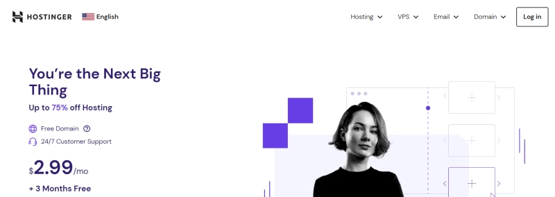
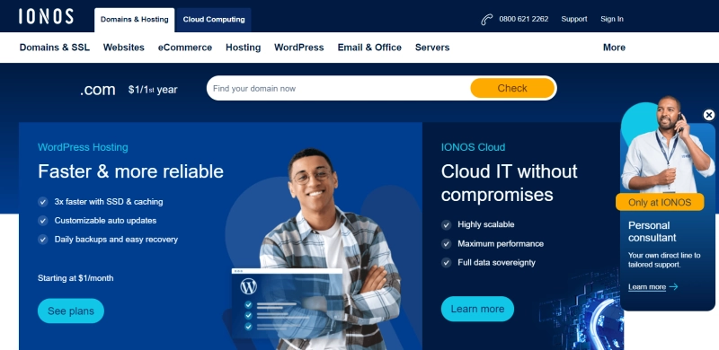

# Top 15 Hetzner Alternatives for Modern Cloud Hosting

Web hosting and cloud services have become the backbone of our digital world. Whether you're running a personal blog or managing enterprise infrastructure, choosing the right hosting provider can make or break your online presence.

Hetzner, the German hosting giant, has built a solid reputation with its dedicated servers, VPS offerings, and competitive pricing. But here's the thing—it's not always the perfect fit. Maybe you need better support, different datacenter locations, or specialized features that Hetzner doesn't quite nail. That's where alternatives come in.

I've spent time digging through what's actually out there, and I'm going to walk you through 15 solid options that might work better for your specific situation.

---

## 1. DigitalOcean

DigitalOcean has carved out a name for itself by keeping things simple. No confusing pricing tiers, no overwhelming dashboards—just straightforward cloud computing that works.

What makes DigitalOcean different is how seriously they take the "easy" part. Their web-based control panel feels like it was designed by someone who actually uses it. Spinning up a server doesn't require a PhD, and their documentation is genuinely helpful rather than just technically correct.

The infrastructure is rock-solid, and when something does go wrong (because let's face it, stuff happens), their support team actually responds like they care.

### Pricing

DigitalOcean's pricing makes sense, which is rarer than it should be. Basic droplets start at $4/month—perfect for testing ideas or running lightweight applications. Need to scale up? You just... scale up. No surprise fees, no hidden costs.

For more complex workloads, their App Platform is free to start, and Kubernetes runs $12/month. They've also got managed databases, block storage, load balancers, and container registries starting at $15/month.

The free support plan works fine for small projects and experimentation. They recently added an uptime monitoring tool that's actually useful for keeping tabs on your site's availability and performance.

## 2. Kamatera

Kamatera takes a different approach—everything is customizable. And I mean *everything*. CPU, RAM, storage—you tweak it all to match exactly what you need and what you can afford.

They offer web servers, app servers, development environments, database servers, and more. The cool part is that each solution can be tailored specifically to your use case. No paying for resources you don't use, no compromising on what you actually need.

They've got pre-configured servers for popular platforms like WordPress, plus remote desktop servers if you need centralized software management. If you're the type who likes control over every detail, Kamatera might be your jam.

If you're looking for cloud infrastructure that adapts to your workflow rather than forcing you into predefined boxes, modern platforms are making deployment faster and more intuitive than ever. The shift toward flexible, scalable hosting solutions means you can now match resources precisely to your workload without overpaying for unused capacity.

👉 [**Discover how flexible cloud hosting transforms your deployment strategy**](https://www.vultr.com/?ref=9738262-9J)

### Pricing

Kamatera uses pay-as-you-go pricing. No setup fees, no long-term contracts—just pay for what you actually use. It's flexible and scales with you.

## 3. Linode

Linode has been around for a while, and they've gotten really good at doing cloud hosting well. They focus on performance and flexibility without making things unnecessarily complicated.

Their API is powerful—you can create, manage, and deploy servers programmatically. The CLI lets you control everything from the command line if you're into that. They also support infrastructure-as-code tools like their validated Terraform provider.

The Reference Architecture Center is surprisingly helpful—actual tested cloud designs for different use cases, complete with tutorials and diagrams. Not just theory, but stuff that works in practice.

### Pricing

Linode keeps pricing transparent and simple—no hidden fees or confusing tiers. Plans range from $5/month for a Nanode to $1,600/month for dedicated CPU instances.

You also get access to add-ons like block storage and backup services, which you can layer on as needed.

## 4. Google Cloud

Google Cloud brings serious firepower to the table. The platform spans computing, storage, databases, analytics, AI, machine learning, networking, and developer tools.

One of Google Cloud's strengths is data analytics. They've built tools that let you analyze massive datasets in real-time, which is pretty wild when you think about the scale involved.

Their AI and machine learning capabilities are legitimately advanced—natural language processing, image and video analysis, predictive analytics. If you're working on anything that needs that level of sophistication, Google Cloud has the tools.

The integration with other Google services (like S3 and Lambda equivalents) makes it a powerful ecosystem for businesses of any size.

### Pricing

Google Cloud uses flexible, usage-based pricing. New customers get $300 in credits to test things out. Plus, everyone gets free access to 20+ products within monthly usage limits—pretty generous for getting started.

## 5. Liquid Web

When it comes to managed VPS services, Liquid Web stands out. Their support team is incredibly reliable and available 24/7. When something breaks at 3am, they're actually there to help.

Unlike some providers, Liquid Web's managed service includes control panel support—cPanel, Plesk, and Interworx. They also give you full root access on managed servers, which isn't always the case elsewhere. You get the convenience of managed hosting without sacrificing customization.

For beginners, they offer managed WordPress solutions with AI-monitored plugin updates, daily backups, and performance monitoring. It's hosting that just works.

### Pricing

Their entry-level package starts at $15/month and includes 2GB RAM, 2 vCPUs, 40GB SSD storage, 10TB bandwidth, and your choice of control panel. Acronis Cyber Backup (100GB) is included too.

Other plans scale from 4GB to 16GB RAM, 4 to 8 vCPUs, and 100GB to 200GB SSD storage, with the same 10TB bandwidth. They also offer bundled security options like threat monitoring and premium business email services.

## 6. AWS

Amazon Web Services (AWS) is the 800-pound gorilla of cloud computing. They offer compute power, storage, databases, analytics—basically everything you need to build digital infrastructure.

AWS is known for reliability and security. High availability, backup, and disaster recovery features are baked in. For the security-conscious, there's encryption and Identity and Access Management (IAM).

The integration with other Amazon services (like S3 and Lambda) makes AWS incredibly powerful for businesses of all sizes. It's comprehensive, but that also means there's a learning curve.

### Pricing

AWS uses pay-as-you-go pricing. You only pay for what you use—no long-term contracts or expensive licensing. It's similar to utility billing like water or electricity. Cost-effective for any size organization, with no extra fees or termination charges when you stop using a service.

## 7. Hostinger

Looking for reliable shared hosting? Hostinger might be your answer. While budget shared hosting often performs poorly, Hostinger delivers performance that rivals much more expensive providers.

Despite its excellent performance, Hostinger remains one of the most affordable options available. Their control panel (hPanel) is intuitive and makes site management straightforward.

If you want reliable, high-performing hosting that doesn't drain your budget, Hostinger is worth exploring.

### Pricing

Hostinger offers three web hosting tiers: Single, Premium, and Business.

Single Web Hosting is the most basic, ideal for beginners, at $1.99/month.

Premium Web Hosting starts at $2.99/month and includes three free months.

Business Web Hosting is designed for small to medium businesses, starting at $3.99/month.

## 8. SiteGround

SiteGround focuses on website speed and performance. The company uses cutting-edge technology to ensure blazing-fast load times.

Their customer support is exceptional—available via phone, chat, and ticketing system. The support team has a reputation for being fast, knowledgeable, and genuinely helpful.

SiteGround also offers free website-building tools with a user-friendly interface, making it accessible even if you're not technical.

### Pricing

SiteGround offers three shared hosting plans: StartUp, GrowBig, and GoGeek.

StartUp includes 10GB web space and up to 10,000 monthly visits, ideal for single-site beginners at $3.99/month.

GrowBig includes 20GB web space, great for multiple sites with up to 100,000 monthly visits, at $6.69/month.

GoGeek is perfect for high-traffic sites, including 40GB web space, white-label options, priority support, and maximum resources at $10.69/month.

## 9. Vultr

Vultr is a popular cloud hosting and VPS alternative that nails speed. Their "One-Click Deploy" feature is genuinely impressive—you can spin up an instance in your chosen datacenter with a single click, typically in under 60 seconds.

Vultr's robust API lets you easily control your servers and resources. They offer fast, reliable, and straightforward hosting solutions tailored precisely to your needs. Whether you're deploying microservices, running databases, or hosting applications, the platform adapts seamlessly.

Modern cloud infrastructure has evolved beyond simple virtual servers. Today's applications demand global reach, instant scalability, and predictable performance. When choosing your hosting solution, consider not just the base specs, but how easily you can expand to new regions, implement load balancing, and maintain uptime during traffic spikes.

👉 [**Experience lightning-fast deployment with Vultr's global infrastructure**](https://www.vultr.com/?ref=9738262-9J)

### Pricing

Vultr's cloud hosting and VPS services range from $2.50/month for basic cloud compute plans to $320/month for high-performance bare-metal servers.

## 10. DreamHost

DreamHost offers various hosting services including shared hosting, VPS, and dedicated hosting. Their control panel is user-friendly, making site maintenance easy.

DreamHost has a reputation for speed and reliability, ensuring minimal downtime for hosted websites. They provide a comprehensive suite of tools to support business initiatives.

Customer support is US-based and award-winning, guaranteeing prompt assistance.

### Pricing

WordPress and website hosting starts at $2.59/month, including a free domain name, fast SSD storage, and email hosting.

DreamHost offers dedicated hosting starting at $169.00/month with a 100% uptime guarantee for customers needing more resources and dedicated server space.

Cloud hosting begins at $0.0075/hour, while managed VPS starts at $10.00/month.

## 11. A2 Hosting

A2 Hosting is known for remarkable speed, achieved through solid-state drives (SSDs), Turbo Server options, and optimized software.

A2 Hosting prioritizes industry-leading security, including HackScan protection, dual web hosting firewalls, and free SSL certificates.

Setup is quick and simple with user-friendly tools. A2 Hosting also offers free website migration, making the switch to their platform easy. You can rely on expert support throughout the process.

### Pricing

A2 Hosting offers various hosting options. Shared hosting starts at $2.99/month, excellent for those just starting their website.

They offer specialized WordPress hosting plans starting at $11.99/month, including additional tools for quickly developing professional-looking websites.

VPS hosting services begin at $39.99/month, offering greater scalability for growing hosting needs.

Dedicated hosting plans start at $155.99/month, providing maximum performance and power.

## 12. InMotion Hosting

InMotion Hosting offers shared hosting, VPS, and dedicated servers with a commitment to top-quality customer service and technical support.

InMotion Hosting guarantees 99.99% uptime and provides security monitoring to protect websites from cyberattacks.

They're a popular choice for WordPress users with over 500,000 installations to date. The company offers the most website transfers on the market, making switching easy.

They're dedicated to the open-source community and offer an industry-leading 90-day money-back guarantee. With award-winning service and support teams, InMotion Hosting is an excellent choice.

### Pricing

InMotion Hosting provides various hosting services. Shared hosting costs as little as $2.99/month, a viable alternative for small organizations.

For high-traffic websites, VPS hosting begins at $19.99/month and dedicated hosting at $89.99/month.

For WordPress users, cPanel WordPress costs $3.99/month, while Managed WordPress costs $15.00/month and includes scalable VPS hosting and premium site features.

The diverse pricing options make it easy to choose a plan that fits your budget and hosting requirements.

## 13. Bluehost

Bluehost is a leading web hosting company that's been providing reliable, affordable hosting solutions for over two decades. They offer shared hosting, VPS hosting, and dedicated hosting with an emphasis on ease of use.

Bluehost's optimized WordPress hosting includes automated installation, updates, and security precautions. Another notable feature is 24-hour customer service.

It's also known for scalability, making it an excellent alternative for growing businesses. Bluehost is a trusted service with a solid reputation for reliability and excellent customer support.

### Pricing

Bluehost's basic plan includes hosting for one website starting at just $2.95/month. Their Plus plan, starting at $5.45/month, is ideal for multiple websites.

Bluehost also has a "Choice Plus" plan offering additional privacy and security measures, starting at $5.45/month.

The Pro plan starts at $13.95/month (for a 36-month term) for those needing more speed and computing power.

## 14. 1&1 IONOS

1&1 IONOS is an affordable web hosting service with various plans to meet different needs. If you're looking for VPS plans, 1&1 IONOS is a wonderful Hetzner alternative with excellent new customer discounts.

For example, their VPS XL package includes 4 vCPUs, 8GB RAM, and a 160GB SSD for just a few dollars per month. However, this discount only applies for the first six months, after which the plan renews at a higher price.

Still, the initial discounts are a significant advantage for those wanting a powerful plan at lower costs. An advantage of 1&1 IONOS VPS is unlimited traffic. If you run many high-traffic websites, you could save money compared to providers that charge overage fees when you exceed bandwidth limits.

### Pricing

IONOS offers three web hosting plans. The "Essential" plan costs $6/month and includes one website or project.

There's also a "Business" option costing $10/month, a good choice for larger web projects.

Finally, there's an "Expert" plan costing $16/month, specifically designed for "multiple large web projects."

## 15. Hostwinds

Hostwinds is a great web hosting company offering various managed VPS services. While their plans aren't as resource-intensive as Hetzner's, they're still ideal for hosting modest to medium-sized websites.

Hostwinds' managed VPS packages include a wealth of services like round-the-clock monitoring, package installation, and server optimization.

Compared to Hetzner, Hostwinds' managed services have greater scope, meaning you can expect more thorough support for your web hosting needs. Additionally, Hostwinds' VPS services are affordable, making them the perfect choice for those seeking exceptional service at a reasonable price.

### Pricing

Hostwinds has a starting price of $8.24. They don't offer a money-back guarantee or prorated refunds for cancelled services within 72 hours of purchase.

---

## Wrapping Up

Choosing the right hosting provider isn't just about specs and pricing—it's about finding the setup that actually fits how you work. Hetzner is solid, but it's not the only game in town.

Whether you need better support, more datacenter locations, specialized features, or just a different approach to cloud infrastructure, there are alternatives out there that might work better for your specific situation. The providers on this list all bring something different to the table—some focus on simplicity, others on power, and some nail the balance between managed convenience and control.

The key is understanding what you actually need versus what sounds good in marketing copy. Take the time to think through your requirements, test a few options if you can, and choose the one that makes your life easier rather than more complicated. Because at the end of the day, hosting should be the thing that *enables* your project, not the thing you're constantly fighting with.
